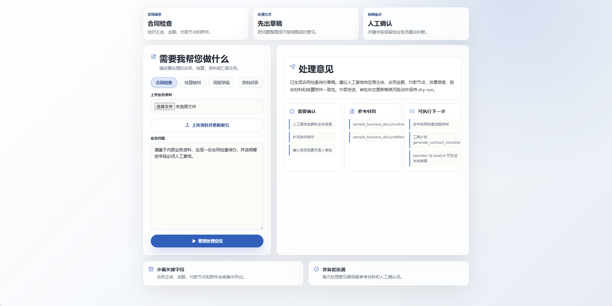
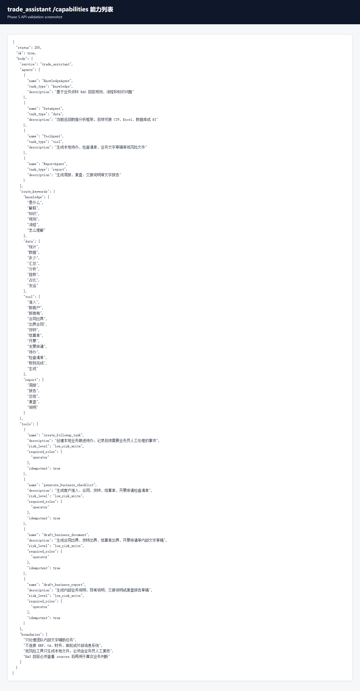

# trade_assistant

`trade_assistant` 是一个面向内部业务团队的 Agent 助手 MVP，用于演示业务资料问答、流程辅助、报告草稿生成、低风险工具计划和可审计的执行闭环。

## 功能

- 多 Agent 路由：按知识问答、数据分析、工具任务、报告任务分流。
- 本地 RAG：支持上传业务资料并构建检索索引。
- 工具白名单：工具计划包含权限、成本和幂等信息。
- Loop Engineering：Planner、Executor、Critic、Reviser、Finalizer 闭环。
- React 前端：提供业务问题输入、资料上传、结果和证据展示。

## 截图





## 运行

后端：

```bash
pip install -r requirements.txt
uvicorn api:app --host 127.0.0.1 --port 8002 --reload
```

前端：

```bash
cd frontend
npm install
npm run dev
```

## 配置

复制 `.env.example` 为 `.env` 后填入本地模型或云模型配置。`.env` 不应提交到仓库。

```bash
cp .env.example .env
```

## 主要接口

- `GET /health`
- `GET /capabilities`
- `POST /documents/upload`
- `POST /chat`
- `POST /chat/stream`
- `POST /loop/chat`

## 数据边界

可以提交脱敏样例、源码、测试、说明文档和关键截图。不要提交真实合同、发票、结算单、客户资料、API Key、本地向量库、运行输出、虚拟环境或前端依赖目录。
