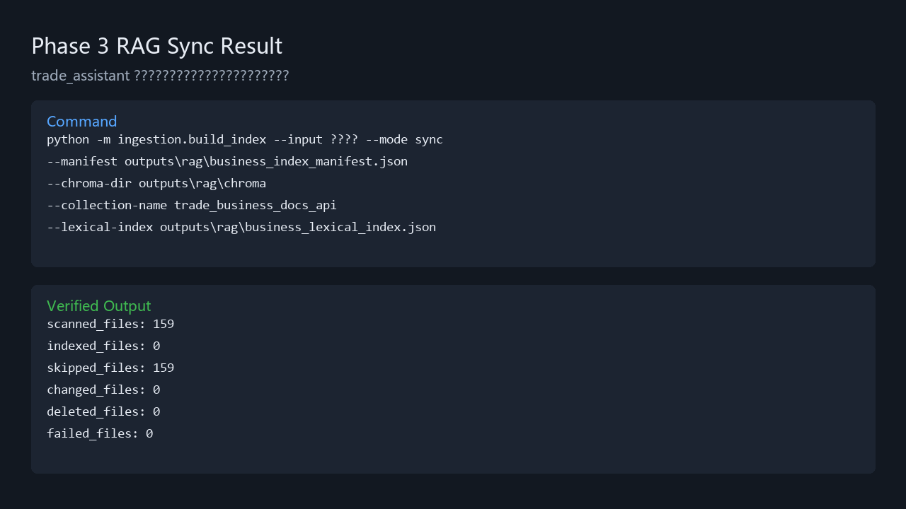
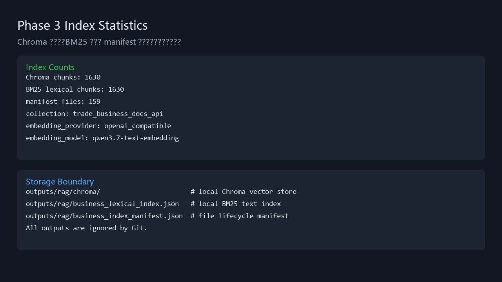
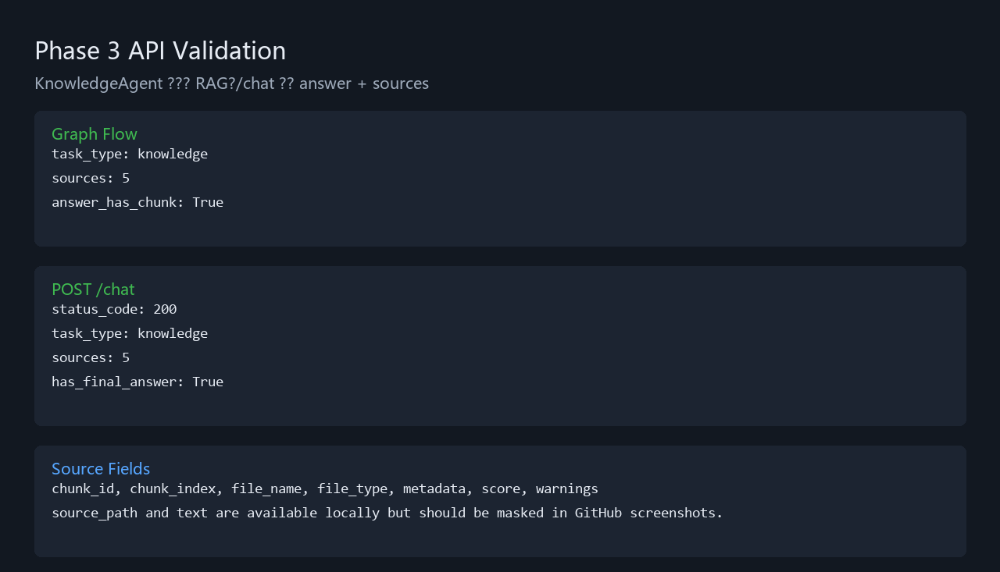
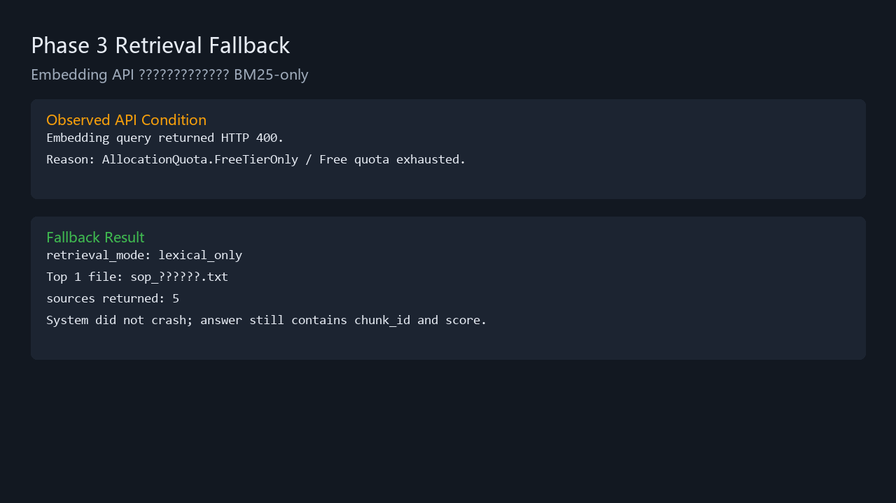
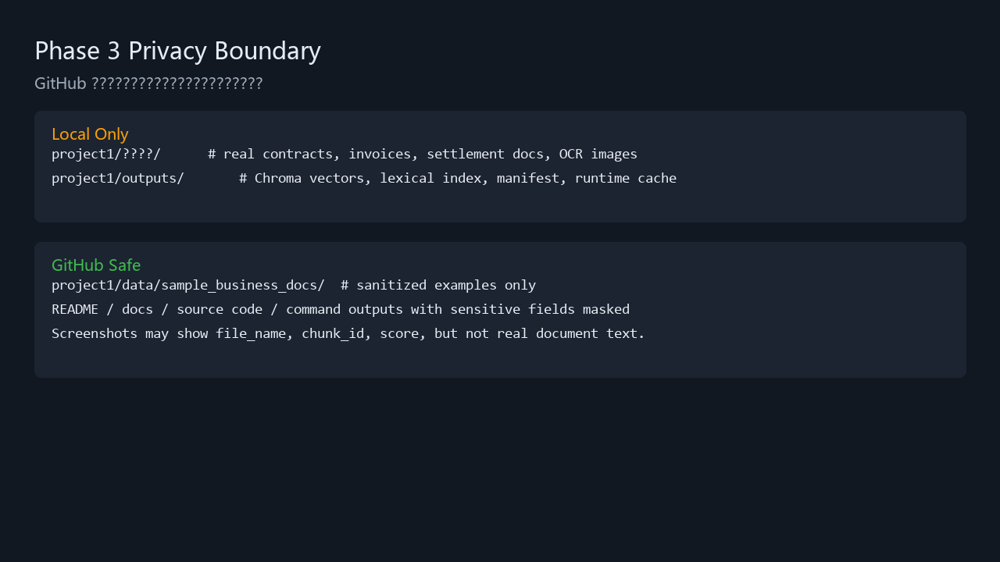

# 阶段 3：trade_assistant 业务资料 RAG 运行证据

> 本文档用于后期 GitHub 展示和面试复盘。不要粘贴真实合同、发票、结算单、客户名称、金额明细或完整来源路径。

## 1. 本阶段目标

把 `trade_assistant` 从模拟知识问答升级为本地业务资料 RAG：

- 支持解析 `txt / docx / pdf / xlsx / jpg / png`。
- 图片通过 Tesseract OCR 识别，语言为 `chi_sim+eng`。
- 使用 Chroma 保存向量索引。
- 使用 BM25/关键词索引补充精确字段召回。
- 使用 manifest 记录文件生命周期，支持 `sync` 增量更新。
- `KnowledgeAgent` 返回回答时必须带来源 `sources`。

## 2. 隐私边界

真实资料目录：

```text
project1/业务资料/
```

该目录已被 `.gitignore` 排除，不上传 GitHub。

本地运行输出：

```text
project1/outputs/
```

该目录包含 Chroma 向量库、BM25 索引、manifest，也不上传 GitHub。

GitHub 只展示：

- 脱敏样例资料。
- 运行命令。
- 统计结果。
- 遮盖敏感内容后的截图。
- 不包含真实正文的 API 返回结构。

## 3. 正式索引命令

```powershell
python -m ingestion.build_index `
  --input 业务资料 `
  --mode sync `
  --manifest outputs\rag\business_index_manifest.json `
  --chroma-dir outputs\rag\chroma `
  --collection-name trade_business_docs_api `
  --lexical-index outputs\rag\business_lexical_index.json
```

## 4. 已验证运行结果

首次正式索引：

```text
scanned_files: 160
indexed_files: 159
skipped_files: 0
changed_files: 0
deleted_files: 0
failed_files: 1
```

失败原因：

```text
Office 临时锁文件 ~$xxx.docx，不是完整 docx。
```

修正后正式 sync：

```text
scanned_files: 159
indexed_files: 0
skipped_files: 159
changed_files: 0
deleted_files: 0
failed_files: 0
```

索引统计：

```text
Chroma chunks: 1630
BM25 lexical chunks: 1630
manifest files: 159
collection: trade_business_docs_api
embedding_provider: openai_compatible
embedding_model: qwen3.7-text-embedding
```

## 5. Smoke Test

为避免污染正式索引，smoke test 使用独立目录：

```text
outputs/rag_smoke/
```

验证结果：

```text
第一次 rebuild：
scanned_files: 3
indexed_files: 3
failed_files: 0

第二次 sync：
scanned_files: 3
indexed_files: 0
skipped_files: 3
failed_files: 0
```

隔离结果：

```text
smoke Chroma chunks: 3
smoke lexical chunks: 3
smoke manifest files: 3
正式 Chroma chunks 未被 smoke test 污染
```

## 6. 当前限制

- 当前 embedding API 免费额度已耗尽，query embedding 会返回 `AllocationQuota.FreeTierOnly`。
- 检索器已实现降级：向量召回失败时自动使用 BM25-only，并返回 `retrieval_warning`。
- 阶段 3 当前回答为证据化 extractive answer，后续可接 LLM synthesis。
- 扫描版 PDF 暂不做逐页 OCR；阶段 3 只对 `jpg/png` 图片做 OCR。

## 7. 应用层验证

图流程验证：

```text
task_type: knowledge
sources: 5
answer_has_chunk: True
```

API 验证：

```text
POST /chat
status_code: 200
task_type: knowledge
sources: 5
has_final_answer: True
```

API source 字段结构：

```text
chunk_id
chunk_index
file_name
file_type
metadata
score
source_path
text
warnings
```

GitHub 截图注意：

```text
可以展示字段结构、数量、chunk_id、score。
不要展示真实 source_path 和 text 正文。
```

## 8. GitHub 截图准备清单

建议后期上传或放入 README 的截图：

1. 正式 sync 结果，展示 `failed_files: 0`。
2. 索引统计，展示 Chroma/BM25/manifest 数量一致。
3. `/chat` 返回结构，展示 `file_name / chunk_id / score`，遮盖 `text/source_path`。
4. `docs/phase3_rag_evidence.md` 隐私边界段落。
5. `.gitignore` 中 `业务资料/` 和 `outputs/` 被排除的规则。

已生成截图文件：

```text
docs/assets/phase3/phase3_sync_result.png
docs/assets/phase3/phase3_index_stats.png
docs/assets/phase3/phase3_api_validation.png
docs/assets/phase3/phase3_fallback_result.png
docs/assets/phase3/phase3_privacy_boundary.png
```

预览：










